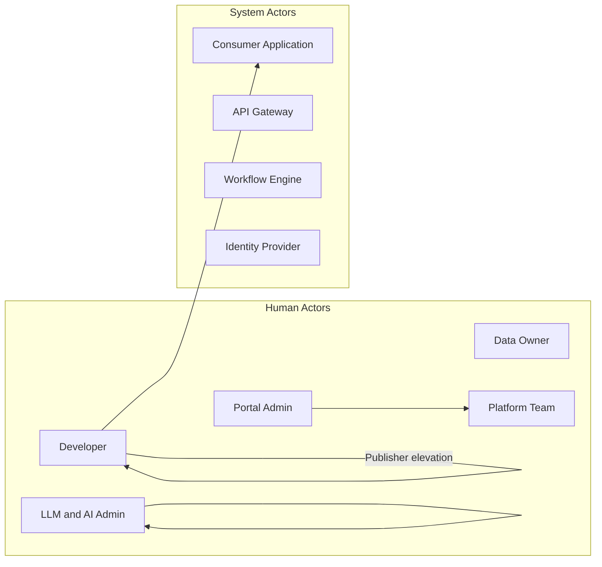

# Actors and Responsibilities

## Document Type

**Recommendation** — role definitions and responsibility matrices for the target platform.

---

## Actor Overview

---

## Portal Personas (Three-Role Model)

See ADR-017 in [`decisions.md`](decisions.md).

### Developer

**Who:** Any authenticated enterprise developer. Starts as an **API consumer**; may earn **domain-scoped publisher capability** after Portal Admin approval.

**Demo persona:** Ahmad Al-Rashidi

| Responsibility | Detail |
|----------------|--------|
| Discover and consume APIs | Catalog, Application Planner, sandbox, SDK snippets |
| Request subscriptions | Standard purpose form for non-LLM APIs |
| Request LLM API access | Complete 11-field ROI justification form (ADR-018) |
| Manage applications | Register applications that consume APIs |
| Request publisher access | Submit `ProviderAccessRequest` for a specific domain |
| Publish APIs (when granted) | Register and manage APIs only in `provider_domains[]` |
| Review consumer requests | Approve/reject subscriptions for APIs in granted domains |

**Does NOT:** Publish APIs outside granted domains; approve own LLM access; bypass workflow for Restricted data.

---

### LLM & AI Admin

**Who:** Administrator responsible for the AI Platform domain (`dom_ai`) — LLM, RAG, embeddings, MCP APIs.

**Demo persona:** Laila Hassan

| Responsibility | Detail |
|----------------|--------|
| Publish and manage LLM APIs | Full lifecycle for `dom_ai` APIs |
| Review LLM access requests | Approve/reject `LLMSubscriptionRequest` with ROI form |
| Co-approve AI API publishing | `InTesting → Published` for AI Platform APIs |
| Define AI-specific policies | Token limits, rate policies (future) |

**Does NOT:** Manage non-AI domain APIs; grant provider elevation (Portal Admin function).

---

### Portal Admin

**Who:** Platform team member with full administrative privileges.

**Demo persona:** Platform Admin

| Responsibility | Detail |
|----------------|--------|
| Operate the platform | Proposals queue, publishing queue, all APIs |
| Approve provider elevation | Review `ProviderAccessRequest`; update `provider_domains[]` |
| Emergency retirement | Move any API to `EmergencyRetired` |
| Manage RBAC | Assign portal roles (three-persona model) |
| Audit and compliance | Access audit logs, platform health |

---

## Supporting Roles (Non-Portal Login)

These actors interact via the **workflow engine** or organizational policy — they do not have separate portal login personas in the MVP mockup.

### Data Owner

**Who:** Individual accountable for specific data assets exposed via APIs.

| Responsibility | Detail |
|----------------|--------|
| Approve/deny access | Via workflow engine for Confidential/Restricted APIs |
| Define data classification | Assign or validate classification on APIs |
| Audit access patterns | Review who has access and for what purpose |

### Platform Team

**Who:** Engineering team building and operating portal and gateway infrastructure.

| Responsibility | Detail |
|----------------|--------|
| Build and deploy portal and gateway | Application development, CI/CD |
| Integrate with workflow engine | Maintain integration contracts |
| Operate gateway cluster | Uptime, scaling, security |
| Support domain onboarding | Tier 1/2/3 migration assistance |

---

## System Actors

### Consumer Application

**What:** Registered application entity representing a machine consumer of APIs.

- Owns OAuth2 service account / credentials
- Target of subscriptions (not individual users)
- Belongs to a Team within a Domain

See ADR-002 in [`decisions.md`](decisions.md).

### API Gateway

**What:** Runtime enforcement layer — validates credentials, checks subscriptions, routes traffic.

### Workflow Engine

**What:** Existing enterprise approval orchestration — authoritative for data access decisions.

### Identity Provider (IdP)

**What:** Enterprise SSO — authenticates human users; issues OAuth2 client credentials.

---

## Responsibility Matrix (RACI)

Legend: **R** = Responsible, **A** = Accountable, **C** = Consulted, **I** = Informed

### API Lifecycle

| Activity | Developer (publisher) | Portal Admin | LLM Admin | Data Owner | Platform Team |
|----------|----------------------|--------------|-----------|------------|---------------|
| Create draft API | R/A | I | I (AI only) | C | I |
| Submit proposal | R | A | I | C | I |
| Accept for review | I | R/A | C | C | I |
| Develop API | R/A | I | I | I | C |
| Submit for testing | R | I | I | I | C |
| Approve publishing | C | R/A | R/A (AI APIs) | I | I |
| Deprecate API | R/A | C | C (AI) | C | I |
| Emergency retire | I | R/A | I | C | R |

### Access & Subscriptions

| Activity | Developer | LLM Admin | Portal Admin | Data Owner | Workflow Engine | Gateway |
|----------|-----------|-----------|--------------|------------|-----------------|---------|
| Request subscription | R/A | I | I | I | — | — |
| Submit LLM ROI form | R/A | I | I | — | — | — |
| Review LLM access | I | R/A | I | — | — | — |
| Approve provider elevation | R (request) | — | R/A | — | — | — |
| Trigger approval workflow | I | I | I | I | R | — |
| Approve access (Confidential+) | I | C | I | R/A | R | — |
| Provider accept/reject consumer | R/A (granted domains) | R/A (LLM) | I | C | I | — |
| Provision credentials | I | I | I | — | — | A |
| Enforce runtime access | — | — | — | — | — | R/A |

### Platform Operations

| Activity | Portal Admin | Platform Team | Security |
|----------|--------------|---------------|----------|
| RBAC configuration | R/A | R | C |
| Provider elevation queue | R/A | I | C |
| LLM access queue | I | I | C |
| Gateway tier migration | C | R/A | C |
| Audit log access | R/A | R | R/A |

---

## Portal RBAC Roles (Summary)

Detailed permissions in [`security-model.md`](security-model.md).

| Portal Role | Typical Assignee | Key Permissions |
|-------------|------------------|-----------------|
| `developer` | Any enterprise developer | Consume APIs; request LLM access; request publisher elevation; publish in granted domains |
| `llm_admin` | AI Platform team lead | Manage `dom_ai` APIs; review LLM ROI access requests |
| `portal_admin` | Platform team | Full admin; provider elevation; audit; all APIs |

**Developer elevation field:** `User.provider_domains: string[]` — domains where developer has publisher capability.

---

## Related Documents

- [`security-model.md`](security-model.md) — RBAC permissions detail
- [`processes-and-workflows.md`](processes-and-workflows.md) — workflows per actor
- [`data-model.md`](data-model.md) — User, Team, Application, ProviderAccessRequest, LLMSubscriptionRequest entities
- [`decisions.md`](decisions.md) — ADR-017 (three personas), ADR-018 (LLM ROI form)
