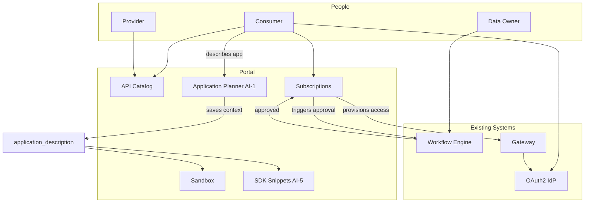

# Concepts Guide for Data Scientists

## Who This Document Is For

You are working on an **Enterprise API Portal** project — a platform that helps people inside the organization find, govern, and use APIs (ways for software systems to share data and services). You do **not** need to be a software developer to understand or explain this project.

This guide lists the concepts you should know, explains each in plain language, and shows **why it matters in this project**. Use it when:

- Prompting an AI assistant (like Cursor) about the project
- Explaining the vision to managers, stakeholders, or teammates
- Connecting your data science background to platform decisions

**Related files:** For short definitions, see `[glossary.md](glossary.md)`. For technical detail, see the other files in `/architecture-context`.

---

## How to Read This Guide

Each concept includes:

| Part                     | Meaning                                      |
| ------------------------ | -------------------------------------------- |
| **What it is**           | Plain-language definition                    |
| **Analogy (if helpful)** | Comparison to data science or everyday ideas |
| **Role in this project** | Why we care and where it shows up            |

---

## Part 1: The Big Picture

### Enterprise API Portal

**What it is:** A single internal website (and supporting systems) where employees can discover APIs, request permission to use them, test them, and manage them over time — with rules, approvals, and AI assistance.

**Analogy:** Think of it as an **internal app store + governance office + lab** for data and services. Instead of buying apps, teams register and consume APIs.

**Role in this project:** This is the product we are designing. Everything else exists to support discovery, governance, security, and reuse.

---

### API (Application Programming Interface)

**What it is:** A defined way for one program to ask another program for data or actions — usually over the internet, often using REST (a common style of web requests).

**Analogy:** Like a **documented function call between systems**. You don't open the other system's database; you call its API with agreed inputs and get agreed outputs.

**Role in this project:** The portal catalogs thousands of these APIs across HR, Finance, Operations, Procurement, Sales, and AI/LLM services. The main problem today is that nobody can find or govern them centrally.

---

### API Ecosystem

**What it is:** The full network of API providers, consumers, policies, tools, and data flows inside the enterprise.

**Analogy:** Similar to an **ML ecosystem** — models, datasets, pipelines, monitoring, and governance — but for APIs instead of models.

**Role in this project:** The goal is a **governed, searchable, secure, reusable** ecosystem, not just a website.

---

### Three Planes (Portal, Gateway, Workflow Engine)

**What it is:** The architecture splits responsibilities into three separate systems:

| Plane               | Simple description                                                                                               |
| ------------------- | ---------------------------------------------------------------------------------------------------------------- |
| **Portal**          | What humans see and click — catalog, requests, admin screens, AI features                                        |
| **Gateway**         | What runs in the background when software actually **calls** an API — security checks, routing, limits           |
| **Workflow Engine** | Existing enterprise system that decides **who must approve** data access — we integrate with it, we don't replace it |

**Analogy:**

- **Portal** = Jupyter notebook UI + catalog
- **Gateway** = production inference endpoint with auth
- **Workflow Engine** = ethics/compliance approval workflow before you get dataset access

**Role in this project:** A critical design rule: the portal must **never** be required for an API to keep working once access is granted. Approvals go through the workflow engine; runtime security goes through the gateway.

---

## Part 2: People and Roles

### API Consumer

**What it is:** A person (often a developer or data scientist) who needs to **use** an API built by another team.

**Role in this project:** Consumers search the catalog, describe what they want to build, request access, test APIs in a sandbox, and get credentials.

---

### API Provider

**What it is:** A person or team that **owns** an API — they register it, document it, manage its lifecycle, and decide which consumers they accept.

**Role in this project:** Providers reduce duplicate APIs, keep documentation current, and approve consumers after workflow approval.

---

### Data Owner

**What it is:** The person accountable for sensitive data (e.g., salary data, financial forecasts). They approve or deny access for Confidential and Restricted APIs.

**Analogy:** Like the **data steward** who must sign off before you get access to a restricted dataset.

**Role in this project:** Approvals happen through the **workflow engine**, not by bypassing it in the portal.

---

### Portal Admin / Platform Team

**What it is:** People who operate the portal — review proposals, manage domains and roles, handle emergencies.

**Role in this project:** They enforce governance rules and see platform-wide analytics and audit logs.

---

### Application (Consumer Application)

**What it is:** Not a human — a **registered software application** that will call APIs (e.g., "HR Leadership Dashboard"). It belongs to a team and holds credentials.

**Analogy:** Like naming your **ML pipeline or notebook job** as the official consumer of a data source — not your personal login.

**Role in this project:** Subscriptions attach to **Applications**, not individuals. This improves audit trails and credential management.

---

### Application Description

**What it is:** A free-text field where the consumer explains what their application does and what data it needs (e.g., "Dashboard showing salary stats and org structure for HR leadership").

**Analogy:** Like the **problem statement** in a data science project brief — but stored once and reused by AI features.

**Role in this project:** This is the **shared AI context**. It powers:

- Application Planner (suggest APIs)
- Subscription purpose drafting
- Personalized code snippets (SDK tab)
- Sandbox pre-filled examples

---

## Part 3: Core Platform Concepts

### API Registry / Catalog

**What it is:** The central list of all registered APIs with metadata: name, description, owner, domain, classification, status, documentation.

**Analogy:** A **model registry** or **data catalog** — but for APIs.

**Role in this project:** Solves "I can't find existing APIs" and enables search, AI recommendations, and governance.

---

### Subscription

**What it is:** A formal record: **Application X is allowed to use API Y for purpose Z**.

**Analogy:** Like an **approved data access grant** with a documented business justification — not anonymous access.

**Role in this project:** Every consumption relationship is tracked. The gateway checks that a valid subscription exists before allowing calls (for managed APIs).

---

### API Lifecycle

**What it is:** The stages an API goes through from idea to retirement — e.g., Draft → Proposed → Under Review → Approved → Development → Testing → Published → Deprecated → Retired.

**Analogy:** Like a **model lifecycle**: experiment → review → staging → production → deprecated.

**Role in this project:** Ensures APIs aren't published without review and can be retired safely with consumer notification.

---

### Workflow / Workflow Engine

**What it is:** An existing enterprise system that routes approval tasks to the right people in the right order (e.g., data owner, security).

**Analogy:** Like a **multi-step approval ticket** in a research governance system — the portal starts it; the engine runs it.

**Role in this project:** **Mandatory constraint:** we must integrate with this engine and **never bypass** it for sensitive data access.

---

### Workflow Instance

**What it is:** A single running approval process tied to one subscription or lifecycle action. The portal shows its status; the workflow engine is the source of truth.

**Role in this project:** Users see "pending approval," "approved," "rejected" on subscription screens.

---

### Gateway Registration Tier (1, 2, 3)

**What it is:** How deeply an API is integrated with the runtime gateway:

| Tier                         | Meaning                                                   |
| ---------------------------- | --------------------------------------------------------- |
| **Tier 1 — Metadata only**   | Listed in portal; traffic does not go through new gateway |
| **Tier 2 — Gateway proxied** | Calls go through gateway; auth enforced                   |
| **Tier 3 — Gateway native**  | Fully managed through gateway with advanced features      |

**Analogy:** Tier 1 = catalog entry only. Tier 2/3 = production deployment with access control at the door.

**Role in this project:** Allows gradual adoption — thousands of existing APIs can start as Tier 1 without rewriting backends.

---

### OAuth2

**What it is:** A standard way to log in and to give applications secure tokens to access APIs — without sharing passwords in code.

**Analogy:** Like **short-lived access tokens** instead of embedding your password in every script.

**Role in this project:** Portal users log in with OAuth2. Consumer applications use OAuth2 credentials to call APIs through the gateway.

---

### OpenAPI Specification (Swagger)

**What it is:** A standard file (usually JSON or YAML) that describes an API: endpoints, parameters, request/response shapes, errors.

**Analogy:** Like a **data dictionary + function signature document** for an API.

**Role in this project:** Powers documentation rendering, sandbox request building, and code snippet (SDK) generation.

---

### Sandbox

**What it is:** An interactive "try it" area on an API's page where you send sample requests and see responses without fully integrating into your code.

**Two modes in this project:**

| Mode                         | Who can use it                | Credentials       | Data                     |
| ---------------------------- | ----------------------------- | ----------------- | ------------------------ |
| **Try before subscribe**     | Anyone allowed to see the API | Demo credentials  | Mock/sample data         |
| **Test with my credentials** | Active subscribers only       | Real OAuth2 token | Live (or mocked in demo) |

**Analogy:** Like a **sandbox notebook environment** with sample data before you get production database access.

**Role in this project:** Reduces blind subscription requests; helps consumers evaluate APIs first. Restricted APIs have limited or no pre-subscription sandbox.

---

### SDK (in this project)

**What it is:** **Not** a downloadable library package maintained by the portal. Here, "SDK" means **auto-generated code snippets** (Python, JavaScript, cURL, Java, Go) built from the OpenAPI spec — personalized using the consumer's application description when available.

**Analogy:** Like Copilot generating a **ready-to-run API client script** tailored to your use case — function names and variables match your project description.

**Role in this project:** Speeds integration for consumers; AI-5 uses `application_description` to personalize snippets.

---

## Part 4: Security and Governance

### Data Classification (Enterprise Taxonomy)

**What it is:** Every API is labeled by how sensitive its data is. Official enterprise levels (most sensitive first):

| Level            | Plain meaning                                                                     |
| ---------------- | --------------------------------------------------------------------------------- |
| **Restricted**   | Severe damage if leaked; named individuals only; encrypted at rest and in transit |
| **Confidential** | Sensitive business data; role-based access; encrypted in transit (TPC-52)         |
| **Internal**     | For employees/vendors with business need; not for external sharing                |
| **Public**       | Approved for public disclosure; still must be explicitly labeled                  |

**Analogy:** Like **data sensitivity tiers** on datasets (public vs internal vs confidential research data).

**Role in this project:** Classification controls **who can see** an API in search, **who must approve** access, and **how sandbox and encryption** behave.

---

### Visibility vs Access

**What it is:** Two different things:

- **Visibility** = Can you **find and read about** the API in the catalog?
- **Access** = Can your application **actually call** it?

**Analogy:** You might **see** that a restricted dataset exists in a catalog entry, but you still need **approval** before you can query it.

**Role in this project:** Confidential APIs may be visible only within a domain; Restricted APIs are not searchable — invitation only.

---

### RBAC (Role-Based Access Control)

**What it is:** Permissions based on roles assigned in the portal: consumer, provider, domain_admin, qa_reviewer, portal_admin, auditor.

**Analogy:** Like **project roles** in a data platform — viewer, editor, admin — but for portal actions.

**Role in this project:** Determines who can publish APIs, approve publishing, view audit logs, etc.

---

### Audit Log

**What it is:** An immutable record of who did what and when — subscription requests, approvals, lifecycle changes, credential events.

**Analogy:** Like **experiment tracking + access logs** for compliance.

**Role in this project:** Required for governance and regulatory accountability.

---

### Provider Approval (After Workflow)

**What it is:** Even after the workflow engine approves access, the **API provider** must accept the consumer before access is fully granted.

**Role in this project:** Two-step gate: **policy approval** (workflow) + **operational approval** (provider). Prevents automatic access without owner accountability.

---

## Part 5: AI Concepts (Most Relevant to You)

### AI Agent (in this project)

**What it is:** An AI feature embedded in a specific place in the portal that helps with one task — search, suggest APIs, draft text, check classification, etc.

**Important rule:** **AI suggests; humans confirm.** AI never auto-grants access or auto-starts approvals without a person clicking confirm.

**Analogy:** Like an **assistant that proposes** features or models — you still approve before training or deployment.

---

### AI Embedding Points (AI-1 through AI-15)

**What it is:** The 15 specific places where AI is built into the portal, grouped by user type:

| Group                              | Examples                                                                                                 |
| ---------------------------------- | -------------------------------------------------------------------------------------------------------- |
| **Consumer (AI-1 to AI-5)**        | Application Planner, semantic search, purpose helper, recommendations, contextual SDK                    |
| **Provider (AI-6 to AI-10)**       | Description generator, tag suggester, classification advisor, duplication detector, spec quality checker |
| **Admin (AI-11 to AI-13)**         | Workflow suggester, anomaly alerts, catalog health summary                                               |
| **Platform-wide (AI-14 to AI-15)** | Floating chat assistant, natural language global search                                                  |

**Role in this project:** Defines **where** AI adds value in the mockup and future product — not one generic chatbot only.

---

### Application Planner (AI-1)

**What it is:** Consumer describes their application in natural language → AI returns a **Proposed API Bundle** (ranked list of relevant APIs) → consumer selects APIs → can request access to the bundle.

**Analogy:** Like describing your ML project goal and getting a **recommended set of datasets and model APIs** to use — with explanations.

**Role in this project:** Core consumer AI experience; connects to `application_description` for all downstream personalization.

---

### Semantic Search (AI-2 / AI-15)

**What it is:** Search that understands **meaning**, not just exact keywords — e.g., "employee compensation statistics" finds salary-related APIs.

**Analogy:** **Embedding-based retrieval** over a catalog — similar to RAG document search, but the "documents" are API records.

**Role in this project:** Improves discovery when users don't know official API names.

---

### Duplication Detection (AI-9)

**What it is:** When someone proposes a new API, AI compares it to existing catalog entries and warns if something similar already exists.

**Analogy:** **Near-duplicate detection** before creating a new dataset or model — promote reuse.

**Role in this project:** Reduces API sprawl and wasted development.

---

### Classification Advisor (AI-8)

**What it is:** AI reads an API's spec and suggests the correct enterprise classification (Restricted / Confidential / Internal / Public) with reasoning.

**Analogy:** Like auto-suggesting **PII/sensitivity labels** on a new dataset schema.

**Role in this project:** Helps providers apply governance correctly; human must confirm.

---

### Contextual SDK Snippets (AI-5)

**What it is:** Code examples generated from the OpenAPI spec **and** the consumer's application description — personalized function names, variables, and usage context in any supported language.

**Role in this project:** Bridges "I found the API" to "I can use it in my app" — especially important for non-developers working with technical teams.

---

### Portal AI Assistant (AI-14)

**What it is:** A floating chat widget on every page — answers questions about the portal, catalog, and workflows; can start the Application Planner flow.

**Analogy:** A **domain-specific copilot** for the API platform.

**Role in this project:** Reduces need to learn the UI; good for onboarding and demos.

---

### RAG, Model APIs, MCP Tools (AI Marketplace)

**What it is:**

- **Model APIs** — endpoints that run LLMs or other models
- **RAG** — retrieval-augmented generation services (search + generate)
- **MCP tools** — standardized way for AI agents to call external tools

**Role in this project:** These are registered in the portal **like any other API** (same lifecycle, subscriptions, classification) under a future **AI Marketplace** module. Training models and managing RAG corpora stay outside the portal.

---

### Governance Intelligence vs AI Platform Management

**What it is:** Two different scopes:

| In portal scope                                                                     | Out of portal scope                                                          |
| ----------------------------------------------------------------------------------- | ---------------------------------------------------------------------------- |
| Semantic search, duplication detection, Application Planner, classification advisor | Model training, fine-tuning, prompt registry internals, RAG corpus ingestion |

**Role in this project:** Avoids building a second AI platform inside the API portal.

---

## Part 6: Data and Structure Concepts

### Domain

**What it is:** A business area — HR, Finance, Operations, Procurement, Sales.

**Role in this project:** APIs belong to a domain; Confidential visibility often limits cross-domain discovery.

---

### Team

**What it is:** A group within a domain that owns one or more consumer applications.

**Role in this project:** Links people to applications and subscriptions for accountability.

---

### Entity / Data Model

**What it is:** The structured "things" the platform stores and how they relate — Domain, Team, User, Application, API, APIVersion, Subscription, WorkflowInstance, Credential, AuditLog.

**Analogy:** Like an **ER diagram** or **feature store schema** — defines what records exist and their relationships.

**Role in this project:** Documented in `[data-model.md](data-model.md)`. Critical fields like `classification`, `purpose`, and `application_description` cannot be added late without pain.

---

### Integration Contract

**What it is:** A fixed agreement on message formats between the portal and external systems (workflow engine, gateway, identity provider) — like an API for the portal itself.

**Analogy:** Like a **data contract** or **schema** for pipeline inputs/outputs.

**Role in this project:** MVP can mock backends, but must use the same contracts as production (`[integration-contracts.md](integration-contracts.md)`).

---

## Part 7: Project Documentation Concepts (For Prompting AI)

When you prompt an AI assistant on this project, these meta-concepts help you get better answers:

### Architecture Context Folder

**What it is:** `/architecture-context` — the **single source of truth** for this project, stored as markdown files in the repo (not just chat history).

**Role for you:** Tell the AI: *"Read architecture-context before answering"* or *"Update decisions.md with this decision."*

---

### ADR (Architecture Decision Record)

**What it is:** A written decision with context and consequences — e.g., ADR-004 "AI suggests, human confirms."

**Analogy:** Like documenting **why you chose Random Forest over XGBoost** in a model card — for future readers.

**Role in this project:** Found in `[decisions.md](decisions.md)`. Check ADRs before proposing changes that conflict.

---

### Requirement (Functional / Non-Functional)

**What it is:**

- **Functional** = what the system must **do** (search APIs, run sandbox, Application Planner)
- **Non-functional** = **how well** (speed, availability, security)

**Role in this project:** Listed in `[requirements.md](requirements.md)` with MVP vs Phase 2 tags.

---

### Assumption vs Decision vs Open Question

| Type              | Meaning                                        | Example                             |
| ----------------- | ---------------------------------------------- | ----------------------------------- |
| **Assumption**    | We believe this is true until proven otherwise | "Workflow engine has a trigger API" |
| **Decision**      | Agreed and recorded (ADR)                      | "OAuth2 for all authentication"     |
| **Open question** | Still needs stakeholder input                  | "Which gateway product?"            |

**Role for you:** When explaining uncertainty, say *"That's an open question (OQ-005)"* vs *"That's decided (ADR-013)."*

---

### MVP vs Phase 2 vs Future

**What it is:** Phasing of delivery:

- **MVP** — demo/mockup with simulated integrations; proves flows and UX
- **Phase 2** — production integrations (live gateway metrics, semantic search at scale)
- **Future** — AI Marketplace module, mTLS for Restricted, etc.

**Role in this project:** Not everything is built at once. Application Planner and core AI demos are MVP; some admin AI features are Phase 2.

---

## Part 8: How to Explain This Project (Cheat Sheet)

### In one sentence

> We're building an internal portal where organization teams can **find**, **govern**, **approve**, and **use** APIs — with AI that helps match applications to the right APIs and generate personalized integration code — without bypassing existing data approval workflows.

---

### To a business stakeholder (30 seconds)

> Today, teams build duplicate APIs because they can't find what already exists. This portal is a central catalog with approval workflows, security labels, and AI that suggests existing APIs before new ones are built. Sensitive data still goes through the organization's existing approval system.

---

### To a technical teammate (30 seconds)

> Three planes: Portal (UI + governance + AI), Gateway (runtime auth and routing), Workflow Engine (approvals). Subscriptions bind Applications to APIs with documented purpose. OAuth2 everywhere. Sandbox before subscribe. AI is advisory at 15 embedding points.

---

### To another data scientist (30 seconds)

> Think **data catalog + access governance + semantic retrieval** for APIs. Consumers describe their app; AI returns a bundle of relevant APIs and personalized code snippets. Classification follows the organization's four tiers. We don't replace the approval workflow — we trigger it. Model/RAG APIs appear in the catalog like any other API.

---

## Part 9: Concepts Map (How Things Connect)

---

## Part 10: Quick Prompting Tips for AI Assistants

When asking an AI to help with this project, include:

1. **Scope:** "Use `/architecture-context` as source of truth."
2. **Role:** "Explain for a data scientist audience" or "Update requirements.md."
3. **Constraint:** "Must not bypass workflow engine" or "AI suggests, human confirms (ADR-004)."
4. **Feature:** Reference by ID — e.g., "Design mockup for AI-1 Application Planner" or "FR-4.2 pre-subscription sandbox."
5. **Classification:** "Follow enterprise taxonomy ADR-013" when discussing security.

**Example prompt:**

> Read architecture-context/decisions.md, target-architecture.md, and design-system.md. Design the consumer Application Planner screen (AI-1): user enters application description, AI returns ranked API bundle, user multi-selects, then requests subscriptions. Use application_description for downstream SDK and sandbox. Mock data for all five domains plus LLM APIs. Follow Brand Colors.csv via brand-* Tailwind tokens. Explain tradeoffs for a non-developer stakeholder.

---

## Related Documents

| If you need…               | Read…                                                                                         |
| -------------------------- | --------------------------------------------------------------------------------------------- |
| Short term definitions     | `[glossary.md](glossary.md)`                                                                  |
| Why we're building this    | `[business-context.md](business-context.md)`                                                  |
| All AI features listed     | `[requirements.md](requirements.md)` FR-8, `[target-architecture.md](target-architecture.md)` |
| Security rules             | `[security-model.md](security-model.md)`                                                      |
| What was decided           | `[decisions.md](decisions.md)`                                                                |
| What's still unknown       | `[open-questions.md](open-questions.md)`                                                      |
| User journeys step by step | `[processes-and-workflows.md](processes-and-workflows.md)`                                    |
| Portal colors & UI rules   | `[design-system.md](design-system.md)`, `portal/public/Brand Colors.csv`                      |

---

