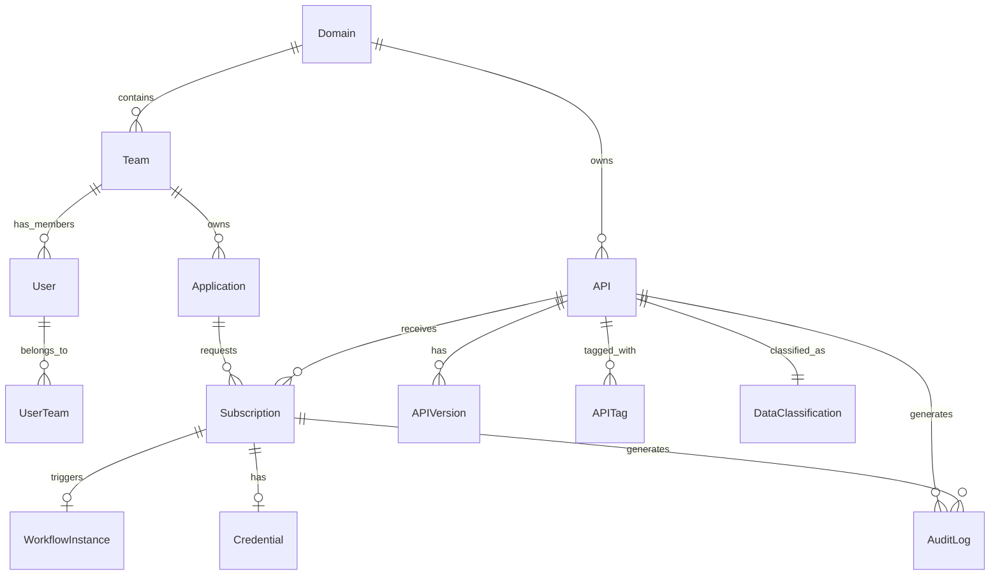

# Data Model

## Document Type

**Decision / Recommendation** — core entity model and schema constraints. MVP must implement these entities; production evolves without breaking changes.

---

## Entity Relationship Diagram



---

## Core Entities

### Domain

Represents a business domain (HR, Finance, Operations, Procurement, Sales).

| Field | Type | Required | Notes |
|-------|------|----------|-------|
| `domain_id` | UUID | Yes | Primary key |
| `name` | String | Yes | Display name |
| `code` | String | Yes | Unique short code (e.g., `hr`, `finance`) |
| `description` | Text | No | |
| `created_at` | Timestamp | Yes | |
| `updated_at` | Timestamp | Yes | |

---

### Team

Organizational unit within a domain. Owns applications.

| Field | Type | Required | Notes |
|-------|------|----------|-------|
| `team_id` | UUID | Yes | Primary key |
| `domain_id` | UUID | Yes | FK → Domain |
| `name` | String | Yes | |
| `description` | Text | No | |
| `created_at` | Timestamp | Yes | |
| `updated_at` | Timestamp | Yes | |

---

### User

Human actor authenticated via enterprise SSO.

| Field | Type | Required | Notes |
|-------|------|----------|-------|
| `user_id` | UUID | Yes | Primary key; maps to IdP `sub` |
| `email` | String | Yes | From IdP |
| `display_name` | String | Yes | From IdP |
| `portal_roles` | Enum[] | Yes | consumer, provider, domain_admin, qa_reviewer, portal_admin, auditor |
| `created_at` | Timestamp | Yes | |
| `updated_at` | Timestamp | Yes | |

**Note:** Users belong to teams via `UserTeam` join table (many-to-many).

---

### UserTeam

| Field | Type | Required | Notes |
|-------|------|----------|-------|
| `user_id` | UUID | Yes | FK → User |
| `team_id` | UUID | Yes | FK → Team |
| `role_in_team` | Enum | Yes | member, lead |

---

### Application (Consumer Application)

Registered machine consumer. **Primary subscription target** (ADR-002).

| Field | Type | Required | Notes |
|-------|------|----------|-------|
| `application_id` | UUID | Yes | Primary key |
| `team_id` | UUID | Yes | FK → Team |
| `name` | String | Yes | |
| `description` | Text | No | Short human-readable description of the application |
| `application_description` | Text | No | **AI context field** — consumer's natural language description of what the application does and what data it needs (e.g., "An HR reporting dashboard that displays salary statistics and org structure for leadership"). Used by AI-1 (Application Planner), AI-3 (Purpose Helper), AI-5 (Contextual SDK), and sandbox pre-fill. Set on first use of the AI Application Planner; editable at any time. |
| `owner_user_id` | UUID | Yes | FK → User (accountable human) |
| `environment` | Enum | Yes | sandbox, production |
| `status` | Enum | Yes | active, suspended, deleted |
| `created_at` | Timestamp | Yes | |
| `updated_at` | Timestamp | Yes | |

---

### API

Central registry entity for a logical API.

| Field | Type | Required | Notes |
|-------|------|----------|-------|
| `api_id` | UUID | Yes | Primary key |
| `domain_id` | UUID | Yes | FK → Domain — **required from MVP** |
| `name` | String | Yes | |
| `slug` | String | Yes | URL-safe unique identifier |
| `description` | Text | Yes | |
| `classification` | Enum | Yes | public, internal, confidential, restricted — **required from MVP** |
| `lifecycle_status` | Enum | Yes | See lifecycle states below |
| `owner_user_id` | UUID | Yes | FK → User (API Provider) |
| `data_owner_user_id` | UUID | No | FK → User (for Confidential/Restricted) |
| `gateway_tier` | Integer | Yes | 1, 2, or 3 (ADR-005) |
| `tags` | String[] | No | |
| `search_index` | JSON | No | Pre-computed search terms for rule-based catalog search (see below) |
| `created_at` | Timestamp | Yes | |
| `updated_at` | Timestamp | Yes | |

**`search_index` JSON shape (optional):**

| Field | Type | Notes |
|-------|------|-------|
| `fluctuations` | String[] | Typos, hyphenations, casing variants of the API name |
| `synonyms` | String[] | Alternative vocabulary users might search with |
| `business_terms` | String[] | Domain jargon, acronyms, department-specific terms |
| `related_api_ids` | String[] | Pre-computed related API recommendations |
| `generated_at` | Timestamp | When the index was generated |
| `model` | String | Source model (e.g. `gemini-2.0-flash`) or `hardcoded` for seed data |

**Lifecycle Status Enum:**
`draft`, `proposed`, `under_review`, `approved`, `in_development`, `in_testing`, `published`, `deprecated`, `retired`, `rejected`, `emergency_retired`

---

### APIVersion

Versioned snapshot of an API's specification and endpoint.

| Field | Type | Required | Notes |
|-------|------|----------|-------|
| `version_id` | UUID | Yes | Primary key |
| `api_id` | UUID | Yes | FK → API |
| `version` | SemVer | Yes | e.g., `1.0.0` |
| `openapi_spec_url` | String | No | Link to spec document |
| `openapi_spec_content` | JSON | No | Inline spec (MVP) |
| `backend_url` | String | No | Required for Tier 2+ |
| `changelog` | Text | No | |
| `status` | Enum | Yes | active, deprecated |
| `created_at` | Timestamp | Yes | |

---

### Subscription

Formalized access relationship (ADR-010).

| Field | Type | Required | Notes |
|-------|------|----------|-------|
| `subscription_id` | UUID | Yes | Primary key |
| `api_id` | UUID | Yes | FK → API |
| `application_id` | UUID | Yes | FK → Application |
| `requested_by_user_id` | UUID | Yes | FK → User |
| `purpose` | Text | Yes | **Required — cannot be null** (audit) |
| `min_api_version` | SemVer | Yes | Minimum version consumer needs |
| `status` | Enum | Yes | See subscription statuses |
| `provider_status` | Enum | Yes | pending, accepted, rejected |
| `workflow_instance_id` | UUID | No | FK → WorkflowInstance |
| `approved_at` | Timestamp | No | |
| `expires_at` | Timestamp | No | Optional expiry |
| `revoked_at` | Timestamp | No | |
| `revoked_reason` | Text | No | |
| `created_at` | Timestamp | Yes | |
| `updated_at` | Timestamp | Yes | |

**Subscription Status Enum:**
`pending`, `workflow_in_progress`, `workflow_approved`, `workflow_rejected`, `provider_pending`, `active`, `revoked`, `expired`

**Status Flow:**
```
pending → workflow_in_progress → workflow_approved → provider_pending → active
                              → workflow_rejected
                                                    → revoked
```

---

### WorkflowInstance

Local cache of workflow engine state (ADR-001). **Not source of truth.**

| Field | Type | Required | Notes |
|-------|------|----------|-------|
| `workflow_instance_id` | UUID | Yes | Primary key (portal-generated) |
| `external_workflow_id` | String | No | ID from workflow engine |
| `correlation_id` | String | Yes | Unique; matches integration contract |
| `workflow_template_id` | String | Yes | e.g., `api-access-confidential` |
| `subscription_id` | UUID | No | FK → Subscription |
| `api_id` | UUID | No | FK → API (for lifecycle workflows) |
| `status` | Enum | Yes | pending, in_progress, approved, rejected, cancelled, expired |
| `approvers` | JSON | No | Array of approver decisions |
| `triggered_at` | Timestamp | Yes | |
| `completed_at` | Timestamp | No | |
| `last_synced_at` | Timestamp | Yes | Last webhook or poll |

---

### Credential

Access credential for a subscription.

| Field | Type | Required | Notes |
|-------|------|----------|-------|
| `credential_id` | UUID | Yes | Primary key |
| `subscription_id` | UUID | Yes | FK → Subscription |
| `application_id` | UUID | Yes | FK → Application |
| `type` | Enum | Yes | api_key (MVP), oauth2_client (Phase 2) |
| `key_prefix` | String | No | Display prefix for API keys |
| `secret_hash` | String | Yes | Encrypted/hashed secret |
| `client_id` | String | No | OAuth2 client ID (Phase 2) |
| `status` | Enum | Yes | active, rotated, revoked |
| `created_at` | Timestamp | Yes | |
| `expires_at` | Timestamp | No | |

**Security:** Raw secrets displayed once at creation; only hash stored.

---

### AuditLog

Immutable record of platform actions.

| Field | Type | Required | Notes |
|-------|------|----------|-------|
| `audit_id` | UUID | Yes | Primary key |
| `timestamp` | Timestamp | Yes | |
| `actor_user_id` | UUID | No | FK → User (null for system actions) |
| `actor_type` | Enum | Yes | user, system, webhook |
| `action` | String | Yes | e.g., `subscription.requested`, `api.lifecycle.changed` |
| `entity_type` | String | Yes | e.g., `subscription`, `api` |
| `entity_id` | UUID | Yes | |
| `payload` | JSON | No | Action-specific details |
| `ip_address` | String | No | |

---

## Cannot-Postpone Decisions (MVP)

These decisions are **locked for MVP** and encoded in the schema above:

| # | Decision | Rationale | ADR |
|---|----------|-----------|-----|
| 1 | Consumer = Application with Team ownership | Credentials, audit, OAuth2 mapping | ADR-002 |
| 2 | `domain_id` + `classification` on every API | Visibility rules depend on both | ADR-009 |
| 3 | `purpose` required on every Subscription | Audit and workflow approver context | — |
| 4 | WorkflowInstance schema matches production contract | Mock implementation, not mock interface | ADR-012 |
| 5 | Subscription binds to API with `min_api_version` | Avoids subscription explosion | ADR-010 |
| 6 | Separate `provider_status` on Subscription | Two-step access grant | ADR-007 |
| 7 | Credential entity separate from Subscription | Supports rotation without re-subscription | ADR-003 |

---

## MVP Demo Data Guidelines

MVP should seed:

| Entity | Count | Notes |
|--------|-------|-------|
| Domains | 1-2 | HR (primary), optionally Finance |
| Teams | 3-5 per domain | |
| Users | 10-15 | Mix of roles |
| Applications | 5-8 | Across teams |
| APIs | 15-25 | Mix of classifications and lifecycle states |
| APIVersions | 1-2 per API | |
| Subscriptions | 10-15 | Various statuses for demo flows |
| WorkflowInstances | 5-10 | Mix of pending, approved, rejected |
| AuditLogs | 50+ | Cover all action types |

---

## Schema Evolution Rules

1. **Additive changes only** for minor versions (new optional fields).
2. **Breaking changes** require major version bump and migration plan.
3. **Never remove** `purpose`, `classification`, `domain_id`, or `application_id` from their entities.
4. **Enum values** can be added but not removed without deprecation cycle.
5. All integration payloads include `contract_version` (see [`integration-contracts.md`](integration-contracts.md)).

---

## Related Documents

- [`decisions.md`](decisions.md) — ADR-002, ADR-009, ADR-010, ADR-012
- [`integration-contracts.md`](integration-contracts.md) — payload schemas referencing these entities
- [`security-model.md`](security-model.md) — classification and RBAC applied to entities
- [`processes-and-workflows.md`](processes-and-workflows.md) — workflows operating on these entities
