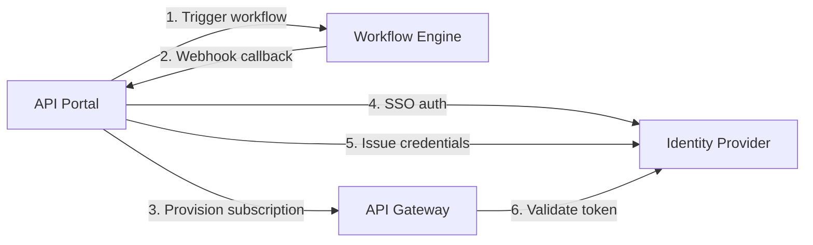

# Integration Contracts

## Document Type

**Recommendation** — stable interface contracts between the portal and external systems. MVP mocks implementations; production uses these same contracts (ADR-012).

---

## Integration Overview



| Integration | Direction | Pattern | MVP |
|-------------|-----------|---------|-----|
| Workflow Engine | Portal → Engine (trigger); Engine → Portal (webhook) | Async request/response + events | Mock in-memory engine |
| API Gateway | Portal → Gateway (provision) | Admin API / event bus | Mock gateway simulator |
| Identity Provider | Portal ↔ IdP | OIDC SSO + client credentials | Mock auth / API keys |

---

## Workflow Engine Integration

### Design Principles

1. Portal **triggers**; engine **orchestrates** (ADR-001).
2. Engine is **source of truth** for workflow state.
3. Portal stores local `WorkflowInstance` as **read-through cache**.
4. All payloads are **versioned** (`contract_version` field).

---

### WF-1: Trigger Workflow

**Direction:** Portal → Workflow Engine

**Endpoint:** `POST /api/v1/workflows/trigger`

**Request:**

```json
{
  "contract_version": "1.0",
  "workflow_template_id": "api-access-approval",
  "correlation_id": "sub_a1b2c3d4-e5f6-7890-abcd-ef1234567890",
  "requested_by": {
    "user_id": "user_123",
    "email": "developer@enterprise.com",
    "team_id": "team_456",
    "domain_id": "domain_hr"
  },
  "context": {
    "subscription_id": "sub_a1b2c3d4",
    "api_id": "api_789",
    "api_name": "Employee Salary Statistics",
    "api_classification": "confidential",
    "api_domain_id": "domain_hr",
    "consumer_application_id": "app_101",
    "consumer_application_name": "HR Analytics Dashboard",
    "purpose": "Monthly salary reporting for HR leadership dashboard"
  }
}
```

**Response (201 Created):**

```json
{
  "workflow_instance_id": "wf_inst_xyz789",
  "correlation_id": "sub_a1b2c3d4-e5f6-7890-abcd-ef1234567890",
  "status": "pending",
  "created_at": "2026-06-27T10:00:00Z"
}
```

**Error Responses:**

| Code | Condition |
|------|-----------|
| 400 | Invalid payload or unknown template |
| 409 | Duplicate correlation_id (idempotent retry) |
| 503 | Engine unavailable |

**Idempotency:** Same `correlation_id` returns existing instance (409 or 200 with existing).

---

### WF-2: Query Workflow Status

**Direction:** Portal → Workflow Engine (polling fallback)

**Endpoint:** `GET /api/v1/workflows/{workflow_instance_id}`

**Response (200 OK):**

```json
{
  "workflow_instance_id": "wf_inst_xyz789",
  "correlation_id": "sub_a1b2c3d4-e5f6-7890-abcd-ef1234567890",
  "status": "approved",
  "completed_at": "2026-06-27T14:30:00Z",
  "approvers": [
    {
      "user_id": "owner_456",
      "role": "data_owner",
      "decision": "approved",
      "decided_at": "2026-06-27T12:00:00Z",
      "comment": "Approved for HR dashboard use"
    }
  ]
}
```

**Status Values:** `pending`, `in_progress`, `approved`, `rejected`, `cancelled`, `expired`

---

### WF-3: Workflow State Change Webhook

**Direction:** Workflow Engine → Portal

**Endpoint:** `POST /api/v1/webhooks/workflow-events` (portal endpoint)

**Headers:**
- `X-Webhook-Signature`: HMAC-SHA256 signature of body using shared secret
- `X-Webhook-Id`: Unique delivery ID for idempotency

**Payload:**

```json
{
  "event_type": "workflow.state_changed",
  "contract_version": "1.0",
  "webhook_id": "wh_abc123",
  "timestamp": "2026-06-27T14:30:00Z",
  "data": {
    "workflow_instance_id": "wf_inst_xyz789",
    "correlation_id": "sub_a1b2c3d4-e5f6-7890-abcd-ef1234567890",
    "previous_status": "in_progress",
    "new_status": "approved",
    "approvers": [
      {
        "user_id": "owner_456",
        "role": "data_owner",
        "decision": "approved",
        "decided_at": "2026-06-27T12:00:00Z",
        "comment": "Approved for HR dashboard use"
      }
    ]
  }
}
```

**Portal Response:** `200 OK` (acknowledge). Retry on non-2xx with exponential backoff.

**Idempotency:** Portal deduplicates by `webhook_id`.

---

### WF-4: Workflow Template Selection

Portal selects workflow template based on API classification:

| Classification | Template ID | Approvers (expected) |
|----------------|-------------|---------------------|
| Public | N/A — no workflow | Self-service |
| Internal | `api-access-internal` | Team lead |
| Confidential | `api-access-confidential` | Data Owner |
| Restricted | `api-access-restricted` | Data Owner + Security |

**Note:** Actual approver resolution is the engine's responsibility. Template IDs must be validated with workflow team (OQ-004).

---

## API Gateway Integration

### Design Principles

1. Portal provisions; gateway enforces (ADR-008).
2. Gateway does **not** call portal at runtime.
3. Eventual consistency target: **< 5 minutes**.
4. Gateway maintains local subscription cache.

---

### GW-1: Provision Subscription

**Direction:** Portal → Gateway

**Endpoint:** `POST /api/v1/subscriptions`

**Request:**

```json
{
  "contract_version": "1.0",
  "subscription_id": "sub_a1b2c3d4",
  "api_id": "api_789",
  "api_version_min": "1.0.0",
  "consumer_application_id": "app_101",
  "status": "active",
  "rate_limit": {
    "requests_per_minute": 100
  },
  "credential": {
    "type": "api_key",
    "key_hash": "sha256:abc123...",
    "key_prefix": "ak_live_abc1"
  },
  "metadata": {
    "purpose": "Monthly salary reporting",
    "approved_at": "2026-06-27T14:30:00Z",
    "expires_at": null
  }
}
```

**Response (201 Created):**

```json
{
  "gateway_subscription_id": "gw_sub_xyz",
  "subscription_id": "sub_a1b2c3d4",
  "status": "active",
  "provisioned_at": "2026-06-27T14:31:00Z"
}
```

---

### GW-2: Update Subscription

**Direction:** Portal → Gateway

**Endpoint:** `PUT /api/v1/subscriptions/{subscription_id}`

**Use Cases:** Status change (revoke), rate limit update, credential rotation.

**Request (revocation example):**

```json
{
  "contract_version": "1.0",
  "status": "revoked",
  "revoked_at": "2026-06-28T09:00:00Z",
  "revoked_reason": "Provider rejected consumer usage"
}
```

---

### GW-3: Deprovision Subscription

**Direction:** Portal → Gateway

**Endpoint:** `DELETE /api/v1/subscriptions/{subscription_id}`

**Response:** `204 No Content`

---

### GW-4: Register API Route (Tier 2+)

**Direction:** Portal → Gateway

**Endpoint:** `POST /api/v1/routes`

**Request:**

```json
{
  "contract_version": "1.0",
  "api_id": "api_789",
  "api_version": "1.0.0",
  "gateway_tier": 2,
  "upstream_url": "https://hr-backend.internal/api/salary-stats",
  "path_prefix": "/api/v1/hr/salary-stats",
  "methods": ["GET", "POST"],
  "auth_required": true
}
```

---

### GW-5: Gateway Metrics Export

**Direction:** Gateway → Analytics Pipeline → Portal

**Pattern:** Gateway emits metrics to observability stack (Prometheus, Datadog, etc.). Portal analytics module queries aggregated metrics.

**Minimum Metrics:**

| Metric | Labels |
|--------|--------|
| `api_requests_total` | api_id, subscription_id, status_code |
| `api_request_duration_seconds` | api_id, subscription_id |
| `api_errors_total` | api_id, subscription_id, error_type |

**Phase:** Phase 2 (not MVP).

---

## Identity Provider Integration

### IdP-1: Portal SSO (Human Users)

**Pattern:** OIDC Authorization Code Flow with PKCE

**Portal Role:** OIDC Relying Party

**Claims Required:** `sub`, `email`, `name`, `groups` (for RBAC mapping)

---

### IdP-2: Service Account Credentials (Phase 2)

**Pattern:** OAuth2 Client Credentials Grant

**Flow:**
1. Consumer registers Application in portal.
2. Portal requests client credentials from IdP for the application.
3. IdP returns `client_id` + `client_secret`.
4. Portal stores encrypted; displays to consumer once.
5. Gateway validates tokens via IdP introspection endpoint.

**MVP Alternative:** Portal-generated API keys (sandbox only, ADR-003).

---

## Synchronization Semantics

### Portal ↔ Workflow Engine

| Scenario | Behavior |
|----------|----------|
| Webhook delivered | Portal updates WorkflowInstance; triggers next step (provider notification) |
| Webhook missed | Polling job queries status API every 5 min for pending instances |
| Engine unavailable on trigger | Portal queues trigger; retries with backoff; subscription stays `pending` |
| Duplicate webhook | Idempotent by `webhook_id` |

### Portal ↔ Gateway

| Scenario | Behavior |
|----------|----------|
| Provision on access grant | Synchronous call; subscription active only after gateway confirms |
| Revocation | Synchronous call; target < 5 min enforcement |
| Gateway unavailable | Portal queues provision; retries; subscription stays `approved_pending_provision` |
| Portal unavailable | Gateway continues enforcing existing subscriptions from local cache |

---

## MVP Mock Implementations

| System | Mock Approach | Contract |
|--------|---------------|----------|
| Workflow Engine | In-memory store; configurable auto-approve delay | Same REST endpoints as above |
| Gateway | Local simulator process; logs provisions | Same REST endpoints as above |
| IdP | Mock OIDC provider or hardcoded test users | OIDC standard |

**Adapter Pattern:** Portal code calls `WorkflowEngineAdapter` and `GatewayAdapter` interfaces. MVP provides mock adapters; production swaps implementations without schema changes.

---

## Contract Versioning

- All payloads include `contract_version` field (currently `"1.0"`).
- Breaking changes increment major version.
- Portal and external systems negotiate supported versions on startup/health check.
- Deprecated fields maintained for one major version cycle.

---

## Related Documents

- [`decisions.md`](decisions.md) — ADR-001, ADR-008, ADR-012
- [`data-model.md`](data-model.md) — WorkflowInstance, Subscription entities
- [`open-questions.md`](open-questions.md) — OQ-001, OQ-004, OQ-005
- [`processes-and-workflows.md`](processes-and-workflows.md) — W5 subscription flow
