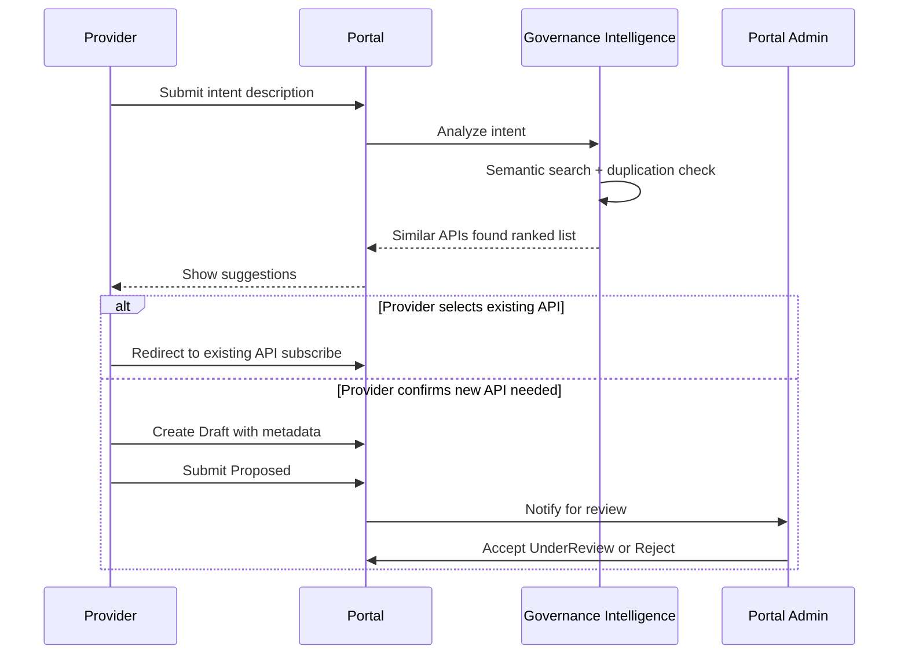
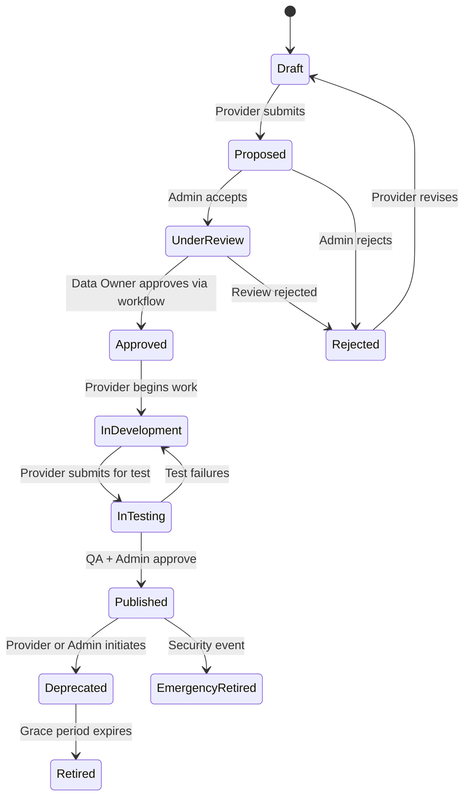
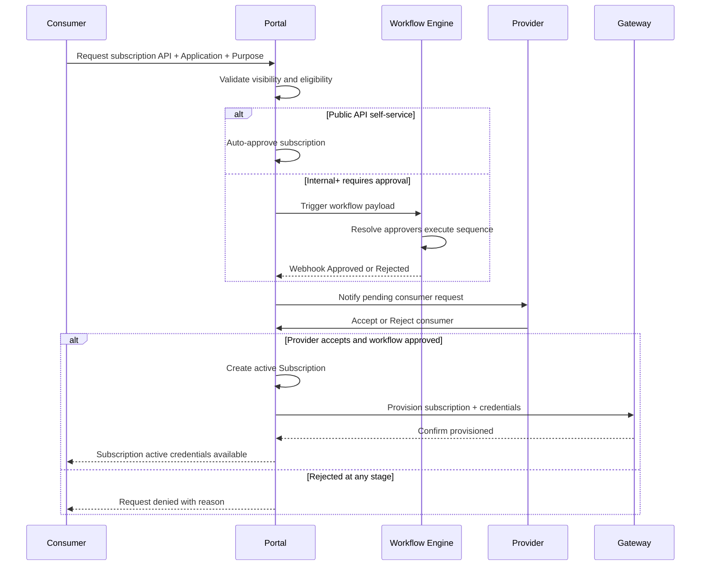

# Processes and Workflows

## Document Type

**Recommendation** — operational workflows for the target platform. Approval authority aligns with [`decisions.md`](decisions.md).

---

## Workflow Index

| # | Workflow | Primary Actors |
|---|----------|----------------|
| W1 | New API Proposal (Intent-Based) | Provider, Governance Intelligence, Portal Admin |
| W2 | Existing API Registration | Provider, Portal Admin |
| W3 | API Lifecycle Management | Provider, QA Reviewer, Portal Admin, Data Owner |
| W4 | API Discovery & Evaluation | Consumer |
| W5 | Subscription Request & Access Grant | Consumer, Portal, Workflow Engine, Provider, Gateway |
| W6 | Subscription Renewal & Revocation | Consumer, Provider, Portal Admin |
| W7 | API Deprecation & Retirement | Provider, Portal Admin, Consumers |
| W8 | Emergency API Retirement | Portal Admin, Platform Team |
| W9 | Gateway Tier Migration | Provider, Platform Team |

---

## W1: New API Proposal (Intent-Based)

**Trigger:** Provider describes intent in natural language (e.g., "API for employee salary statistics").

**Governance rule:** AI suggestions are advisory. Provider must explicitly confirm before a new API enters the lifecycle.

**Duplication prevention metric:** Track `redirected_to_existing / total_proposals`.

---

## W2: Existing API Registration

**Trigger:** Provider registers an already-deployed API for discovery and governance.

### Steps

1. Provider creates API record in **Draft** state.
2. Provider fills metadata:
   - Name, description, domain
   - Data classification
   - Owner contact
   - OpenAPI spec (upload or URL)
   - Gateway registration tier (default: Tier 1)
   - Backend endpoint URL (for Tier 2+)
3. Provider submits → state becomes **Proposed**.
4. Portal Admin reviews metadata completeness → **UnderReview** or **Rejected**.
5. For Confidential/Restricted: Data Owner validates classification via workflow (if required by policy).
6. Admin approves → **Approved** (metadata registered; no development phase needed).
7. Provider marks ready → skip to **InTesting** or directly **Published** (admin discretion for existing APIs).

**Note:** Existing APIs may bypass `InDevelopment` if already deployed. Portal Admin configures fast-track path.

---

## W3: API Lifecycle Management

### State Machine

### Transition Approval Matrix

| Transition | Approver | Mechanism |
|------------|----------|-----------|
| Draft → Proposed | Provider | Self-service |
| Proposed → UnderReview | Portal Admin | Portal action |
| Proposed → Rejected | Portal Admin | Portal action |
| UnderReview → Approved | Data Owner | Workflow engine |
| UnderReview → Rejected | Data Owner / Admin | Workflow or portal |
| Approved → InDevelopment | Provider | Self-service |
| InDevelopment → InTesting | Provider | Self-service |
| InTesting → Published | QA Reviewer + Portal Admin | Portal action |
| InTesting → InDevelopment | QA Reviewer | Portal action |
| Published → Deprecated | Provider (Admin co-sign for Restricted) | Portal action |
| Deprecated → Retired | System (grace period timer) or Admin | Automated / manual |
| Any → EmergencyRetired | Portal Admin only | Portal action |

---

## W4: API Discovery & Evaluation

**Trigger:** Consumer searches for an API.

### Steps

1. Consumer enters search query (keyword or natural language).
2. Portal applies **visibility filter** based on consumer's domain and API classification (see [`security-model.md`](security-model.md)).
3. Results displayed with: name, description, domain, owner, classification badge, version, status.
4. Consumer opens API detail page: documentation, OpenAPI spec, code examples, sandbox link (if Published).
5. Consumer decides to subscribe → W5.

### Visibility Rules (Summary)

| Classification | Visible To |
|----------------|------------|
| Public | All authenticated users |
| Internal | All authenticated users |
| Confidential | Same domain + explicit cross-domain grant |
| Restricted | Not in search; invitation only |

---

## W5: Subscription Request & Access Grant

**Trigger:** Consumer requests access to a Published API.

This is the **most critical workflow** — it integrates portal, workflow engine, provider, and gateway.

### Subscription Payload (to Workflow Engine)

See [`integration-contracts.md`](integration-contracts.md) for full schema. Minimum fields:

- `subscription_id`, `api_id`, `api_classification`
- `consumer_application_id`, `consumer_team_id`, `consumer_domain_id`
- `purpose` (required — free text justification)
- `requested_by_user_id`

### Access Grant Rules

| Classification | Workflow Required | Provider Approval Required |
|----------------|-------------------|---------------------------|
| Public | No | No (auto-grant) |
| Internal | Yes | Yes (notification + accept) |
| Confidential | Yes (includes Data Owner) | Yes |
| Restricted | Yes (includes Data Owner) | Yes (explicit invitation initiates request) |

**Decision (ADR-007):** Workflow approval alone does **not** grant runtime access. Provider must accept the consumer.

---

## W6: Subscription Renewal & Revocation

### Renewal

- Subscriptions have an optional `expires_at` (policy-driven).
- Before expiry: portal notifies consumer and provider.
- Renewal re-triggers workflow if classification requires it.

### Revocation

| Revoked By | Scenario | Effect |
|------------|----------|--------|
| Provider | Consumer misusing API | Subscription deactivated; gateway denies immediately |
| Portal Admin | Policy violation | Same |
| Consumer | No longer needed | Self-service deactivation |
| System | API retired | All subscriptions deactivated on retirement |

Revocation propagates to gateway within SLA (< 5 min target).

---

## W7: API Deprecation & Retirement

### Deprecation

1. Provider (or Admin) initiates deprecation on Published API.
2. Portal sets deprecation date and grace period (configurable per classification).
3. All active subscribers notified via portal and email.
4. API remains callable but marked deprecated in catalog and response headers.

### Retirement

1. Grace period expires (or Admin forces early retirement).
2. State → **Retired**.
3. All subscriptions deactivated.
4. Gateway returns 410 Gone (Tier 2+) or portal marks unavailable (Tier 1).
5. API removed from search results; accessible in archive view for audit.

---

## W8: Emergency API Retirement

**Trigger:** Security incident, compliance violation, or critical defect.

1. Portal Admin moves API to **EmergencyRetired** (no grace period).
2. Gateway immediately blocks all traffic (Tier 2+).
3. All subscriptions deactivated.
4. Incident logged in audit trail.
5. Provider and subscribers notified.
6. Post-incident review required before any re-publication.

---

## W9: Gateway Tier Migration

**Trigger:** Provider or Platform Team initiates migration from Tier 1 → Tier 2 → Tier 3.

### Tier 1 → Tier 2

1. Provider provides backend endpoint URL and auth requirements.
2. Platform Team configures gateway route.
3. Provider updates DNS/routing to point through gateway (coordinated cutover).
4. Portal updates registration tier.
5. Smoke test via sandbox.

### Tier 2 → Tier 3

1. Full platform features enabled: advanced rate limiting, WAF rules, custom policies.
2. May require API contract changes (standardized error format, auth header).
3. Platform Team executes migration checklist.

**No forced migration timeline** — domains adopt at their own pace with platform support.

---

## Workflow State Synchronization

### Principle

Portal maintains a **local cache** of workflow state for display. Workflow engine is the **source of truth**.

| Event | Source | Portal Action |
|-------|--------|---------------|
| Workflow triggered | Portal | Create `WorkflowInstance` record (status: pending) |
| State change | Workflow engine webhook | Update `WorkflowInstance` status |
| Polling fallback | Portal scheduled job | Query workflow engine status API if webhook missed |
| Terminal state | Workflow engine | Update subscription status; trigger next step |

See [`integration-contracts.md`](integration-contracts.md) for webhook schema and idempotency rules.

---

## Related Documents

- [`target-architecture.md`](target-architecture.md) — architectural context
- [`integration-contracts.md`](integration-contracts.md) — workflow and gateway contracts
- [`security-model.md`](security-model.md) — visibility and access rules
- [`data-model.md`](data-model.md) — Subscription, WorkflowInstance entities
