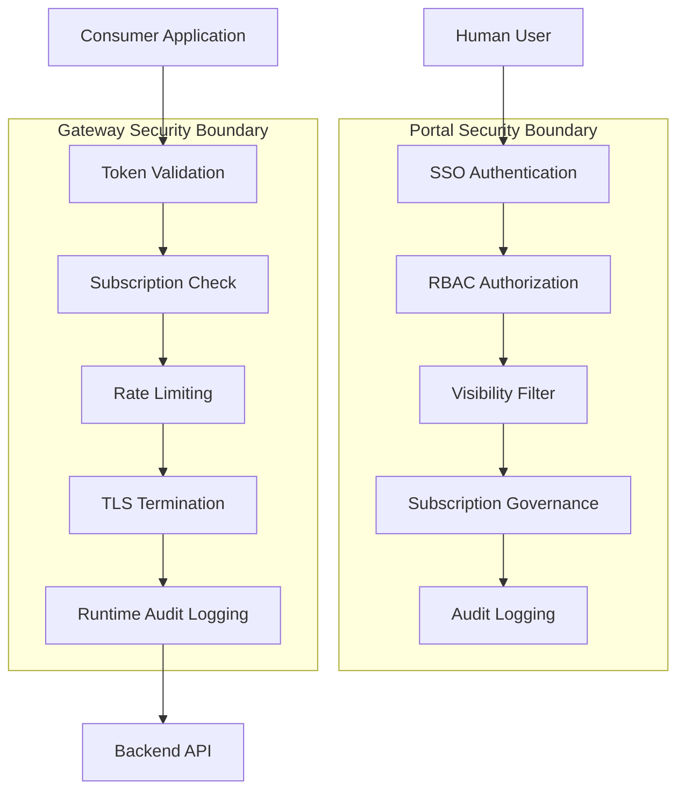

# Security Model

## Document Type

**Decision / Recommendation** — data classification framework, RBAC model, and security boundary definitions between portal and gateway.

---

## Security Architecture Overview

**Principle:** Portal governs *who can see and request*. Gateway governs *who can call*.

---

## Data Classification Framework

**Source:** Enterprise official data classification standard. Adopted verbatim per ADR-013. No modifications permitted without security/compliance approval.

### Classification Levels (Descending Sensitivity)

#### Restricted

> Highly sensitive information whose disclosure could cause severe damage to the organization.

**Handling Requirements:**
- Encrypted at **rest and in transit**
- Access limited to **named individuals** (no broad role-based grants)
- No copies made without explicit authorization
- Secure destruction required when no longer needed

**Portal implications:**
- API metadata for Restricted APIs must be encrypted at rest in the portal database (not just in transit)
- Not discoverable via search; accessible only via direct invitation from provider or admin
- Subscription requires named individual tracking — Application owner `user_id` recorded and auditable
- Workflow requires Data Owner + Security approval
- Provider must explicitly invite before consumer can initiate a subscription request
- Gateway enforces mTLS in addition to OAuth2 (Future phase)

---

#### Confidential

> Sensitive business information not intended for public disclosure.

**Handling Requirements:**
- Encrypted in transit (per **TPC-52**)
- Access controlled by role (not open to all)
- Stored on authorized systems only
- No sharing via personal channels (email, messaging, etc.)

**Portal implications:**
- Visible only to users within the owning domain (and explicit cross-domain grants via OQ-006)
- Subscription requires Data Owner approval via workflow engine
- Provider must accept consumer after workflow approval
- All access via gateway must be over TLS (enforced at Tier 2+); Tier 1 APIs in this class must attest to TPC-52 compliance independently
- Policy reference: **TPC-52** (enterprise internal policy — portal team must obtain and document applicable controls)

---

#### Internal

> Information intended for use within the vendor-organization relationship.

**Handling Requirements:**
- Access limited to employees (and authorized vendors) with a business need
- Stored on company-authorized systems only
- Not to be shared externally without approval

**Portal implications:**
- Visible to all authenticated portal users
- Subscription requires workflow approval and provider acceptance
- No external consumer applications allowed (domain restriction enforced at subscription level)

---

#### Public

> Information approved for public disclosure.

**Handling Requirements:**
- No special handling requirements
- Verify classification before treating data as public

**Portal implications:**
- Visible to all authenticated portal users
- Self-service subscription; no workflow required
- Provider may optionally require acceptance notification
- Classification must still be explicitly assigned — APIs are not Public by default

---

### Classification in Descending Sensitivity Order

| Level | Visibility | Subscription | Encryption at Rest | Encrypted in Transit |
|-------|------------|--------------|-------------------|---------------------|
| **Restricted** | Invitation only | Named individual + Data Owner + Security + Provider | **Required** | Required |
| **Confidential** | Owning domain | Data Owner + Provider (TPC-52) | Recommended | Required |
| **Internal** | All portal users | Workflow + Provider | Standard | Required |
| **Public** | All portal users | Self-service | Standard | Required |

All API traffic is encrypted in transit regardless of classification (TLS enforced at gateway for Tier 2+).

---

### Classification Assignment Rules

| Rule | Detail |
|------|--------|
| Assigned at registration | Provider selects classification; mandatory field — no default |
| Data Owner validation | Required for Confidential and Restricted before publishing |
| Upgrade requires re-review | Lower → higher classification triggers full re-approval workflow |
| Downgrade requires admin approval | Higher → lower classification requires Portal Admin + Data Owner sign-off |
| Cannot be unset | Once assigned, classification cannot be removed; only changed through governance workflow |
| Public is not the default | Providers must explicitly select Public; the portal does not infer it |

---

### Visibility Rules

Applied at search time and API detail access:

| Classification | Search Visible | Detail Accessible | Cross-Domain |
|----------------|---------------|-------------------|--------------|
| Public | All users | All users | Yes |
| Internal | All users | All users | Yes (internal only) |
| Confidential | Same domain users | Same domain users | Only with explicit grant (OQ-006) |
| Restricted | Not in search results | Invited users only | Invitation from provider/admin only |

**Implementation:** Portal applies visibility filter before returning search results or API detail pages. Filter checks: `user.domain_id` vs `api.domain_id` AND `api.classification`.

---

### Access Rules

Visibility ≠ Access. A user may *see* an API but still requires an active subscription to *consume* it.

| Classification | Workflow Required | Data Owner Approval | Provider Approval | Self-Service |
|----------------|-------------------|--------------------|--------------------|--------------|
| Public | No | No | No | Yes |
| Internal | Yes | No | Yes | No |
| Confidential | Yes | Yes (TPC-52) | Yes | No |
| Restricted | Yes | Yes + Security | Yes | No (invitation initiates) |

---

## RBAC Model

### Portal Roles

| Role | Scope | Key Permissions |
|------|-------|-----------------|
| `consumer` | Self | Search (filtered), view eligible APIs, request subscriptions, manage own applications, view own subscriptions |
| `provider` | Own APIs | Register/manage own APIs, upload specs, manage lifecycle (within allowed transitions), accept/reject consumers |
| `domain_admin` | Domain | Manage teams/providers in domain, view domain analytics, approve cross-domain grants |
| `qa_reviewer` | Platform | Review APIs in testing, approve/reject publishing |
| `portal_admin` | Platform | All admin functions, RBAC management, emergency retirement, domain/tag configuration |
| `auditor` | Platform (read-only) | View audit logs, analytics, subscription records |

### Permission Matrix

| Action | consumer | provider | domain_admin | qa_reviewer | portal_admin | auditor |
|--------|----------|----------|--------------|-------------|--------------|---------|
| Search APIs (filtered) | Yes | Yes | Yes | Yes | Yes | Yes |
| View API details (eligible) | Yes | Yes | Yes | Yes | Yes | Yes |
| Register new API | No | Yes | Yes | No | Yes | No |
| Manage own API lifecycle | No | Yes | Yes | No | Yes | No |
| Submit API for review | No | Yes | Yes | No | Yes | No |
| Approve publishing | No | No | No | Yes | Yes | No |
| Request subscription | Yes | Yes | Yes | Yes | Yes | No |
| Accept/reject consumer | No | Own APIs | Domain APIs | No | Yes | No |
| Register application | Yes | Yes | Yes | Yes | Yes | No |
| View own subscriptions | Yes | Yes | Yes | Yes | Yes | No |
| View all subscriptions | No | Own APIs | Domain | No | Yes | Yes |
| Emergency retire API | No | No | No | No | Yes | No |
| Manage RBAC | No | No | No | No | Yes | No |
| View audit logs | No | No | No | No | Yes | Yes |
| Revoke subscription | No | Own APIs | Domain | No | Yes | No |

### Role Assignment

- `consumer` — default for all authenticated users
- `provider` — assigned by domain_admin or portal_admin
- `domain_admin` — assigned by portal_admin
- `qa_reviewer`, `portal_admin`, `auditor` — assigned by portal_admin only

---

## Portal vs Gateway Security Boundaries

### Portal Enforces

| Control | Mechanism |
|---------|-----------|
| Human authentication | OAuth2 Authorization Code flow via enterprise IdP |
| Role-based authorization | RBAC checks on every portal action |
| Visibility filtering | Classification + domain rules on search and detail |
| Subscription governance | Workflow trigger, provider approval, purpose validation |
| Lifecycle authorization | Transition approval matrix (who can move API to which state) |
| Audit logging | All portal actions logged with actor, entity, payload |
| Credential provisioning | OAuth2 client credential request to IdP on subscription activation |
| Credential display | Show `client_secret` once at issuance; store encrypted |

### Gateway Enforces

| Control | Mechanism |
|---------|-----------|
| Token validation | Validate OAuth2 token via IdP introspection or JWT verification on every request |
| Subscription authorization | Check active subscription exists for consumer application + API |
| Rate limiting | Per-subscription and per-API throttling |
| TLS termination | Encrypt all traffic in transit (required for all classification levels) |
| Request validation | Schema validation, size limits (Tier 3) |
| Runtime audit logging | Log every API call with consumer, API, timestamp, status |
| IP allowlisting | Optional per-API configuration (Restricted tier) |
| mTLS enforcement | Required for Restricted APIs (Future phase) |

### What Neither Portal Nor Gateway Enforces

| Control | Owner |
|---------|-------|
| Backend business logic authorization | Domain backend API |
| Data-level access control (row/column) | Domain backend API / database |
| Workflow approver resolution | Workflow engine |
| AI model safety / prompt injection | AI Platform team |

---

## Credential Strategy

**Decision:** ADR-003 (updated 2026-06-27). OAuth2 is confirmed available from MVP. API keys are not part of the credential design at any phase.

### Portal Authentication (All Phases)

| Attribute | Value |
|-----------|-------|
| Type | OAuth2 Authorization Code flow |
| Users | All human portal users authenticate via enterprise OAuth2 provider |
| Scope | Portal access, role claims |
| Session | Token-based; managed by portal frontend |

### Application Service Account Credentials (MVP)

| Attribute | Value |
|-----------|-------|
| Type | OAuth2 Client Credentials grant |
| Registration | Consumer registers Application in portal → portal requests client credentials from IdP |
| Issuance | Enterprise OAuth2 provider issues `client_id` + `client_secret` |
| Storage | `client_secret` encrypted at rest in portal; shown once to consumer |
| Validation | Gateway validates tokens via OAuth2 introspection or JWT verification |
| Rotation | IdP-managed or triggered from portal credential management UI |
| Scope | Per-application; bound to active subscriptions |

### Restricted APIs (Future)

| Attribute | Value |
|-----------|-------|
| Additional requirement | mTLS client certificate in addition to OAuth2 |
| Certificate authority | Enterprise PKI |
| Validation | Gateway validates certificate chain + OAuth2 token |

**Note on API Keys:** API keys were considered for MVP and rejected. OAuth2 is available now and is the correct mechanism. Any legacy mention of "API keys" in implementation references should be treated as superseded.

---

## Audit Requirements

### Events Requiring Audit Log

| Category | Events |
|----------|--------|
| Authentication | Login, logout, failed login |
| API lifecycle | State transitions, classification changes, emergency retirement |
| Subscriptions | Request, workflow trigger, workflow result, provider accept/reject, activation, revocation |
| Credentials | Creation, rotation, revocation |
| Administration | RBAC changes, domain configuration, emergency actions |
| Gateway (runtime) | API call (consumer, API, status, latency) — emitted by gateway |

### Audit Log Properties

| Property | Requirement |
|----------|-------------|
| Immutability | Append-only; no updates or deletes |
| Actor identification | User ID or system/webhook identifier |
| Timestamp | UTC, millisecond precision |
| Entity reference | Entity type + ID |
| Payload | Sufficient context for compliance review |
| Retention | Per enterprise policy (OQ-008) |

---

## Threat Model (Summary)

| Threat | Mitigation | Layer |
|--------|------------|-------|
| Unauthorized API discovery | Classification-based visibility filter | Portal |
| Unauthorized API access | Subscription check + OAuth2 token validation | Gateway |
| Workflow bypass | Portal always triggers workflow for Internal+; no direct grant path | Portal |
| Credential theft | OAuth2 client_secret encrypted at rest; shown once at issuance; rotation support | Portal + IdP |
| Privilege escalation | RBAC with least privilege; admin actions audited | Portal |
| Subscription without purpose | Schema constraint: purpose NOT NULL | Portal |
| Stale subscription after revocation | Gateway local cache with sync; revocation SLA < 5 min | Gateway |
| AI auto-granting access | AI advisory only; human confirmation required (ADR-004) | Portal |
| Restricted data in search index | Restricted APIs excluded from all search indexes entirely | Portal |
| Restricted metadata exposure | Encrypted at rest in portal database (ADR-013) | Portal |
| Confidential data in unauthorized transit | TPC-52 compliance required; TLS enforced at gateway; Tier 1 owners attest independently | Gateway + Owner |

---

## Compliance Considerations

| Requirement | Implementation |
|-------------|----------------|
| Data access audit trail | AuditLog entity + gateway runtime logs |
| Purpose justification | Required on every subscription |
| Data Owner approval | Workflow engine for Confidential/Restricted |
| Provider accountability | Provider accept/reject after workflow |
| Classification enforcement | Schema constraint + visibility filter + access rules |
| Credential lifecycle | Creation, rotation, revocation all audited |

---

## Related Documents

- [`decisions.md`](decisions.md) — ADR-003, ADR-004, ADR-007, ADR-009, ADR-013
- [`data-model.md`](data-model.md) — entity schemas with security fields
- [`integration-contracts.md`](integration-contracts.md) — credential provisioning to gateway
- [`processes-and-workflows.md`](processes-and-workflows.md) — W5 access grant flow
- [`open-questions.md`](open-questions.md) — OQ-006 (cross-domain Confidential), OQ-008 (audit retention)
