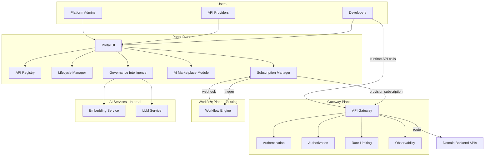
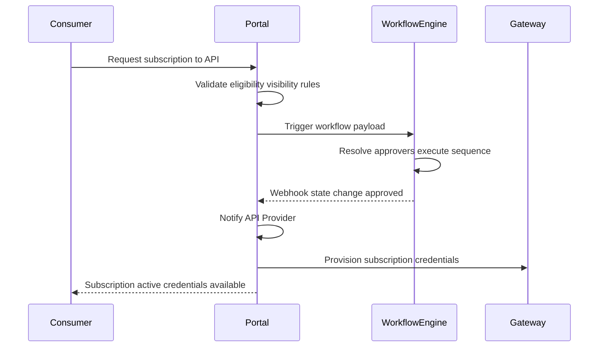

# Target Architecture

## Document Type

**Recommendation** — proposed target state. Individual decisions are recorded in [`decisions.md`](decisions.md).

---

## Architecture Overview

The enterprise API ecosystem is organized into **three planes** with clear boundaries:

---

## Design Principles

| # | Principle | Rationale |
|---|-----------|-----------|
| P1 | **Separation of planes** | Portal (human/governance), Gateway (runtime), Workflow (approvals) have distinct responsibilities |
| P2 | **Portal never on runtime critical path** | API calls must not depend on portal availability |
| P3 | **Workflow engine is authoritative** | Portal triggers; engine orchestrates approvers and sequences |
| P4 | **Loose coupling** | Portal and gateway communicate via admin API or event bus, not synchronous runtime calls |
| P5 | **Incremental adoption** | Metadata-first registration; gateway migration is optional and phased |
| P6 | **Classification-driven governance** | Visibility, access, and security rules derive from data classification |
| P7 | **AI suggests, human confirms** | AI assists discovery and routing suggestions; humans approve actions that grant access |
| P8 | **Application-centric consumption** | Subscriptions bind to applications (service accounts), not individual users |
| P9 | **Audit everything** | All access requests, approvals, credential provisioning, and lifecycle transitions are logged |
| P10 | **Federation over centralization** | Domains own their APIs; portal federates metadata and governance |
| P11 | **Brand-consistent UI** | Portal UI uses the official palette from `Brand Colors.csv`; see `design-system.md` |

---

## Portal Plane (Human Interface)

The portal is the primary interaction point for discovery, governance, and developer experience.

### Components

| Component | Responsibility |
|-----------|----------------|
| **API Registry** | Canonical catalog of APIs, versions, metadata, ownership, classification, tags |
| **Lifecycle Manager** | State machine for API lifecycle (Draft → Published → Retired) |
| **Subscription Manager** | Consumer access requests, subscription records, workflow integration, credential provisioning |
| **Developer Experience** | Documentation viewer, sandbox testing, code examples, SDK links |
| **Governance Intelligence** | Semantic search, duplication detection, intent-based suggestions, auto-tagging |
| **AI Marketplace Module** | Governed catalog of model APIs, RAG endpoints, MCP tools — same lifecycle/subscription model |
| **Analytics Dashboard** | Technical metrics (from gateway) + business metrics (reuse, duplication, domain demand) |
| **Admin Console** | Platform configuration, RBAC, emergency actions, audit log access |

### Portal UI & Design System

The interactive mockup in `portal/` follows the brand palette in **`portal/public/Brand Colors.csv`**. All UI work must conform to [`design-system.md`](design-system.md):

- Tailwind tokens defined in `portal/src/index.css`
- TypeScript constants in `portal/src/config/brand-colors.ts`
- Semantic branding in `portal/src/config/brand.ts`

When adding screens or components, use `brand-*` utility classes — do not introduce ad-hoc colors.

### Portal Does NOT

- Route runtime API traffic
- Determine approver sequences (workflow engine does)
- Store or manage AI model weights, prompts, or RAG corpora
- Replace domain backend systems

---

## Gateway Plane (Runtime)

A distinct runtime layer responsible for enforcement at the point of API consumption.

### Components

| Component | Responsibility |
|-----------|----------------|
| **API Gateway** | Request routing, protocol handling, backend discovery |
| **Authentication** | Validate OAuth2 tokens, service account credentials; mTLS for Restricted APIs |
| **Authorization** | Verify active subscription exists for consumer + API combination |
| **Rate Limiting** | Per-subscription and per-API throttling |
| **Traffic Management** | Load balancing, circuit breaking, timeout policies |
| **Observability** | Request/response logging, metrics (latency, errors, throughput), distributed tracing |
| **Runtime Security** | TLS termination, request validation, IP allowlisting (where configured) |

### Gateway Does NOT

- Manage API lifecycle or metadata (portal does)
- Orchestrate approval workflows (workflow engine does)
- Provide developer-facing UI

### Gateway Registration Tiers

| Tier | Registration | Traffic | Auth Enforcement |
|------|-------------|---------|------------------|
| Tier 1 — Metadata Only | Portal only | Direct to backend | Backend responsibility |
| Tier 2 — Gateway Proxied | Portal + Gateway | Through gateway | Gateway enforced |
| Tier 3 — Gateway Native | Portal + Gateway | Through gateway | Gateway enforced + full platform features |

---

## Workflow Plane (Existing — Integration Only)

The enterprise workflow engine is **not built by this project**. The portal integrates with it.

### Integration Pattern

See [`integration-contracts.md`](integration-contracts.md) for payload schemas.

---

## AI Integration Architecture

AI capabilities are organized into **three structural layers** and **four actor-scoped groups** of embedded agents.

### Structural Layers

#### Layer 1: Governance Intelligence (In-Portal Features)

Portal-native AI features consuming internal AI/LLM services. All outputs are advisory — human confirmation required before any workflow is triggered or lifecycle transition occurs (ADR-004).

#### Layer 2: AI APIs as Governed Resources (AI Marketplace Module)

Model APIs, RAG endpoints, LLM APIs, and MCP tools registered in the portal exactly like REST APIs — same lifecycle state machine, same subscription and access control, same enterprise classification model. Planned as a future module (ADR-006).

#### Layer 3: AI Platform Management (Out of Scope)

Model training, prompt management, RAG corpus, fine-tuning, token budgets — managed by the AI Platform team. The portal exposes their interfaces; it does not manage their internals.

---

### AI Embedding Points — Consumer-Side

| ID | Name | Where | What AI Does |
|----|------|--------|--------------|
| **AI-1** | Application Planner | Consumer: dedicated screen + Dashboard entry card | Consumer describes their application in natural language. AI maps description to a ranked Proposed API Bundle from the catalog. Consumer selects APIs from the bundle. |
| **AI-2** | Semantic Search | Consumer: API Catalog search bar | Understands natural language intent beyond keywords. Returns ranked results with a relevance explanation card. |
| **AI-3** | Subscription Purpose Helper | Consumer: subscription request form | AI drafts the mandatory purpose/justification field using the consumer's stored application description. Consumer edits before submitting. |
| **AI-4** | API Recommendations | Consumer: API Detail page sidebar | Suggests related APIs the consumer may also need, based on spec similarity and catalog usage patterns. |
| **AI-5** | Contextual SDK Snippets | Consumer: SDK & Code tab on API Detail | Uses the consumer's stored `application_description` to generate named, contextual code snippets in the selected language (cURL, Python, JS/TS, Java, Go). Functions named after their use case, variables named for their domain. Sandbox request builder pre-filled from the same context. |

**Key design principle for AI-1 + AI-5:** The consumer's `application_description` (stored on the Application entity) is the shared context that connects the Application Planner, SDK generation, and sandbox pre-fill. It is written once and reused across all AI-assisted developer experience features.

---

### AI Embedding Points — Provider-Side

| ID | Name | Where | What AI Does |
|----|------|--------|--------------|
| **AI-6** | Description Generator | Provider: API registration form | Reads uploaded OpenAPI spec and generates a human-readable API description. Provider reviews and edits. |
| **AI-7** | Tag Suggester | Provider: API registration form | Analyzes spec and description to suggest relevant catalog tags with confidence scores. |
| **AI-8** | Classification Advisor | Provider: API registration form (classification picker) | Analyzes spec field names, data types, and endpoint semantics to suggest the appropriate enterprise classification level (Restricted / Confidential / Internal / Public) with a written rationale. Provider must confirm. |
| **AI-9** | Duplication Detector | Provider: new API proposal submission | Semantic comparison of proposed API against existing catalog. Returns ranked similar APIs with similarity score and explanation. Provider must explicitly confirm intent to create a new API before proceeding. |
| **AI-10** | Spec Quality Checker | Provider: after spec upload | Reviews OpenAPI spec for missing operation descriptions, missing response examples, undocumented error codes, security scheme gaps. Returns an actionable checklist. |

---

### AI Embedding Points — Admin/Governance-Side

| ID | Name | Where | What AI Does |
|----|------|--------|--------------|
| **AI-11** | Workflow Template Suggester | Admin: proposal review panel | Analyzes classification level, domain, and data sensitivity from API metadata to recommend the appropriate workflow template. Admin confirms before triggering. |
| **AI-12** | Audit Anomaly Alerts | Admin: dashboard | Background process detects unusual access patterns — off-hours access spikes, volume anomalies, unusual consumer-API combinations — and surfaces alert cards with anomaly description. |
| **AI-13** | Catalog Health Summary | Admin: dashboard | Generates a natural language governance summary (e.g., "3 APIs have been in Draft for over 30 days; HR domain has the highest cross-domain subscription demand; 2 Confidential APIs lack a designated Data Owner"). |

---

### AI Embedding Points — Platform-Wide

| ID | Name | Where | What AI Does |
|----|------|--------|--------------|
| **AI-14** | Portal AI Assistant | All pages — floating widget (bottom-right) | Conversational assistant that answers questions about the portal, catalog, and workflows. Can initiate the Application Planner flow. Provides deep links to relevant resources. |
| **AI-15** | Natural Language Global Search | All search bars | Full semantic understanding across catalog content. Results include an AI-generated context card explaining how the query was interpreted. |

---

### Sandbox Architecture

The portal provides two sandbox modes per API Detail page (ADR-014):

| Mode | Access | Auth | Data |
|------|--------|------|------|
| **Try Before Subscribe** | All eligible viewers of the API | Demo credentials (no subscription required) | Mocked sample responses |
| **Test With My Credentials** | Active subscribers only | Consumer's real OAuth2 token | Live backend (or mocked in demo/MVP) |

The sandbox request builder is pre-filled with contextual example values derived from the consumer's stored `application_description` when available. Both modes present an interactive request builder with endpoint selector, query params, headers, request body, and a live request/response panel.

Classification-based sandbox restrictions:
- **Public / Internal:** Full sandbox access, sample data visible
- **Confidential:** Sandbox available with masked/anonymized sample data; real data only post-subscription
- **Restricted:** No pre-subscription sandbox; invitation required before any interaction

---

### SDK Code Generation Architecture

The portal generates code snippets from the API's OpenAPI spec on demand (ADR-015). No SDK packages are built or maintained by the portal — that is the API provider's responsibility.

**Generation process:**
1. Portal reads the API's OpenAPI spec (stored as `openapi_spec_content` on `APIVersion`)
2. Consumer selects language (cURL, Python, JavaScript/TypeScript, Java, Go)
3. If consumer has an active Application with `application_description`: AI personalizes the snippet — functions named for their use case, variables named for their domain, comments referencing their context
4. If no application description: generic template snippet generated from spec
5. Consumer's OAuth2 credentials injected into the snippet (masked for display; real values available after subscription)

**Supported outputs:** Request snippet, complete client class, authentication helper, error handling wrapper.

---

## Data Flow Summary

| Flow | Path |
|------|------|
| API discovery | Developer → Portal Registry → (optional) Governance Intelligence |
| API registration | Provider → Portal Lifecycle Manager → Registry |
| Access request | Consumer → Portal Subscription Manager → Workflow Engine |
| Access grant | Workflow Engine → Portal → Gateway (subscription record + credentials) |
| API consumption | Consumer App → Gateway → Backend API |
| Analytics | Gateway metrics → Analytics pipeline → Portal Dashboard |
| Duplication check | Provider intent → Governance Intelligence → suggestion → human confirm |

---

## Non-Functional Targets (Proposed)

| Attribute | Target |
|-----------|--------|
| Portal availability | 99.9% (business hours critical) |
| Gateway availability | 99.95% (runtime critical) |
| Portal not on API call path | 100% — zero runtime dependency |
| Search latency | < 2s for semantic search (P95) |
| Subscription provisioning | < 5 min after final approval (excluding workflow time) |
| Audit log retention | Per enterprise compliance policy (TBD) |

---

## MVP vs Production

| Capability | MVP | Production |
|------------|-----|------------|
| API Registry | Demo data | Real domain APIs |
| Workflow integration | Mock/simulated | Live workflow engine |
| Gateway | Simulated or local | Production gateway cluster |
| Credentials | API keys (sandbox) | OAuth2/OIDC service accounts |
| AI features | Basic keyword + mock semantic | Production embedding service |
| Analytics | Static dashboards | Live gateway metrics pipeline |
| Domains | 1-2 demo domains | All five domains |

---

## Related Documents

- [`decisions.md`](decisions.md) — settled architecture decisions
- [`data-model.md`](data-model.md) — entity model
- [`security-model.md`](security-model.md) — classification and RBAC
- [`integration-contracts.md`](integration-contracts.md) — external system contracts
- [`processes-and-workflows.md`](processes-and-workflows.md) — operational workflows
